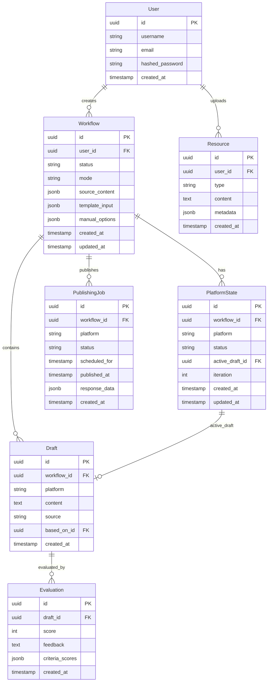

# Database Schema

Complete database schema documentation for MorphPost Backend.

**Database:** PostgreSQL 14+  
**ORM:** SQLAlchemy 2.0 (async)  
**Migrations:** Alembic

---

## Entity Relationship Diagram



---

## Tables

### User

Stores user account information.

**File:** `src/models/user.py`

| Column | Type | Constraints | Description |
|--------|------|-------------|-------------|
| `id` | UUID | PRIMARY KEY | Unique user identifier |
| `username` | VARCHAR(50) | UNIQUE, NOT NULL | Username |
| `email` | VARCHAR(255) | UNIQUE, NOT NULL | Email address |
| `hashed_password` | VARCHAR(255) | NOT NULL | Bcrypt hashed password |
| `created_at` | TIMESTAMP | NOT NULL, DEFAULT NOW() | Account creation time |

**Indexes:**
- `idx_user_email` on `email`
- `idx_user_username` on `username`

---

### Workflow

Top-level workflow metadata.

**File:** `src/models/workflow.py`

| Column | Type | Constraints | Description |
|--------|------|-------------|-------------|
| `id` | UUID | PRIMARY KEY | Unique workflow identifier |
| `user_id` | UUID | FOREIGN KEY (User.id), NOT NULL | Owner user |
| `status` | VARCHAR(50) | NOT NULL | Workflow status |
| `mode` | VARCHAR(20) | NOT NULL | Creation mode (manual/template) |
| `source_content` | JSONB | NULLABLE | Original content (manual mode) |
| `template_input` | JSONB | NULLABLE | Template data (template mode) |
| `manual_options` | JSONB | NULLABLE | Generation preferences |
| `created_at` | TIMESTAMP | NOT NULL, DEFAULT NOW() | Creation time |
| `updated_at` | TIMESTAMP | NOT NULL, DEFAULT NOW() | Last update time |

**Status Values:**
- `running` - Workflow in progress
- `awaiting_review` - Waiting for human review
- `completed` - All platforms processed
- `failed` - Workflow failed

**Indexes:**
- `idx_workflow_user_id` on `user_id`
- `idx_workflow_status` on `status`
- `idx_workflow_created_at` on `created_at`

**Relationships:**
- `user` → User (many-to-one)
- `platform_states` → PlatformState (one-to-many)
- `drafts` → Draft (one-to-many)
- `publishing_jobs` → PublishingJob (one-to-many)

---

### PlatformState

Per-platform workflow state.

**File:** `src/models/platform_state.py`

| Column | Type | Constraints | Description |
|--------|------|-------------|-------------|
| `id` | UUID | PRIMARY KEY | Unique state identifier |
| `workflow_id` | UUID | FOREIGN KEY (Workflow.id), NOT NULL | Parent workflow |
| `platform` | VARCHAR(20) | NOT NULL | Platform name |
| `status` | VARCHAR(50) | NOT NULL | Platform status |
| `active_draft_id` | UUID | FOREIGN KEY (Draft.id), NULLABLE | Current draft |
| `iteration` | INTEGER | NOT NULL, DEFAULT 0 | Regeneration count |
| `created_at` | TIMESTAMP | NOT NULL, DEFAULT NOW() | Creation time |
| `updated_at` | TIMESTAMP | NOT NULL, DEFAULT NOW() | Last update time |

**Platform Values:**
- `linkedin` - LinkedIn post
- `x` - X/Twitter post
- `blog` - Blog article

**Status Values:**
- `generating` - AI generating content
- `evaluating` - AI evaluating draft
- `awaiting_review` - Ready for human review
- `accepted` - Draft accepted
- `rejected` - Draft rejected
- `published` - Content published

**Indexes:**
- `idx_platform_state_workflow_id` on `workflow_id`
- `idx_platform_state_platform` on `platform`
- `idx_platform_state_status` on `status`

**Unique Constraint:**
- `uq_workflow_platform` on `(workflow_id, platform)`

**Relationships:**
- `workflow` → Workflow (many-to-one)
- `active_draft` → Draft (many-to-one)

---

### Draft

Generated content versions.

**File:** `src/models/draft.py`

| Column | Type | Constraints | Description |
|--------|------|-------------|-------------|
| `id` | UUID | PRIMARY KEY | Unique draft identifier |
| `workflow_id` | UUID | FOREIGN KEY (Workflow.id), NOT NULL | Parent workflow |
| `platform` | VARCHAR(20) | NOT NULL | Target platform |
| `content` | TEXT | NOT NULL | Draft content |
| `source` | VARCHAR(20) | NOT NULL | Creation source |
| `based_on_id` | UUID | FOREIGN KEY (Draft.id), NULLABLE | Parent draft (for regenerations) |
| `created_at` | TIMESTAMP | NOT NULL, DEFAULT NOW() | Creation time |

**Source Values:**
- `ai` - AI-generated
- `human` - User-edited

**Indexes:**
- `idx_draft_workflow_id` on `workflow_id`
- `idx_draft_platform` on `platform`
- `idx_draft_created_at` on `created_at`

**Relationships:**
- `workflow` → Workflow (many-to-one)
- `evaluations` → Evaluation (one-to-many)
- `based_on` → Draft (self-referential, many-to-one)

---

### Evaluation

AI evaluation results.

**File:** `src/models/evaluation.py`

| Column | Type | Constraints | Description |
|--------|------|-------------|-------------|
| `id` | UUID | PRIMARY KEY | Unique evaluation identifier |
| `draft_id` | UUID | FOREIGN KEY (Draft.id), NOT NULL | Evaluated draft |
| `score` | INTEGER | NOT NULL, CHECK (0-100) | Overall score |
| `feedback` | TEXT | NULLABLE | Improvement suggestions |
| `criteria_scores` | JSONB | NULLABLE | Detailed criteria breakdown |
| `created_at` | TIMESTAMP | NOT NULL, DEFAULT NOW() | Evaluation time |

**Criteria Scores Structure:**
```json
{
  "platform_appropriateness": 85,
  "style_consistency": 90,
  "clarity": 88,
  "engagement": 92,
  "grammar": 95
}
```

**Indexes:**
- `idx_evaluation_draft_id` on `draft_id`
- `idx_evaluation_score` on `score`

**Relationships:**
- `draft` → Draft (many-to-one)

---

### Resource

User-uploaded resources (style samples, references).

**File:** `src/models/resource.py`

| Column | Type | Constraints | Description |
|--------|------|-------------|-------------|
| `id` | UUID | PRIMARY KEY | Unique resource identifier |
| `user_id` | UUID | FOREIGN KEY (User.id), NOT NULL | Owner user |
| `type` | VARCHAR(50) | NOT NULL | Resource type |
| `content` | TEXT | NOT NULL | Resource content |
| `metadata` | JSONB | NULLABLE | Additional metadata |
| `created_at` | TIMESTAMP | NOT NULL, DEFAULT NOW() | Upload time |

**Type Values:**
- `style_sample` - Writing style example
- `reference` - Reference material
- `image` - Image description/URL

**Metadata Structure:**
```json
{
  "title": "Sample LinkedIn Post",
  "platform": "linkedin",
  "tags": ["technical", "ai"]
}
```

**Indexes:**
- `idx_resource_user_id` on `user_id`
- `idx_resource_type` on `type`

**Relationships:**
- `user` → User (many-to-one)

---

### PublishingJob

Publishing job tracking.

**File:** `src/models/publishing_job.py`

| Column | Type | Constraints | Description |
|--------|------|-------------|-------------|
| `id` | UUID | PRIMARY KEY | Unique job identifier |
| `workflow_id` | UUID | FOREIGN KEY (Workflow.id), NOT NULL | Parent workflow |
| `platform` | VARCHAR(20) | NOT NULL | Target platform |
| `status` | VARCHAR(50) | NOT NULL | Job status |
| `scheduled_for` | TIMESTAMP | NULLABLE | Scheduled publish time |
| `published_at` | TIMESTAMP | NULLABLE | Actual publish time |
| `response_data` | JSONB | NULLABLE | Platform API response |
| `created_at` | TIMESTAMP | NOT NULL, DEFAULT NOW() | Job creation time |

**Status Values:**
- `queued` - Waiting to publish
- `scheduled` - Scheduled for future
- `publishing` - Currently publishing
- `published` - Successfully published
- `failed` - Publishing failed

**Response Data Structure:**
```json
{
  "platform_post_id": "123456789",
  "url": "https://linkedin.com/posts/...",
  "engagement": {
    "likes": 0,
    "comments": 0,
    "shares": 0
  }
}
```

**Indexes:**
- `idx_publishing_job_workflow_id` on `workflow_id`
- `idx_publishing_job_status` on `status`
- `idx_publishing_job_scheduled_for` on `scheduled_for`

**Relationships:**
- `workflow` → Workflow (many-to-one)

---

## LangGraph Checkpointer Tables

LangGraph automatically creates these tables for state persistence:

### checkpoints

Stores workflow state snapshots.

| Column | Type | Description |
|--------|------|-------------|
| `thread_id` | VARCHAR | Workflow ID |
| `checkpoint_id` | VARCHAR | Checkpoint identifier |
| `parent_checkpoint_id` | VARCHAR | Previous checkpoint |
| `checkpoint` | BYTEA | Serialized state |
| `metadata` | JSONB | Checkpoint metadata |
| `created_at` | TIMESTAMP | Creation time |

### checkpoint_writes

Stores pending state writes.

| Column | Type | Description |
|--------|------|-------------|
| `thread_id` | VARCHAR | Workflow ID |
| `checkpoint_id` | VARCHAR | Checkpoint identifier |
| `task_id` | VARCHAR | Task identifier |
| `idx` | INTEGER | Write index |
| `channel` | VARCHAR | State channel |
| `value` | BYTEA | Serialized value |

---

## Migrations

### Creating Migrations

```bash
# Auto-generate migration from model changes
alembic revision --autogenerate -m "description"

# Create empty migration
alembic revision -m "description"
```

### Applying Migrations

```bash
# Upgrade to latest
alembic upgrade head

# Upgrade to specific revision
alembic upgrade <revision_id>

# Downgrade one revision
alembic downgrade -1

# Show current revision
alembic current

# Show migration history
alembic history
```

---

## Common Queries

### Get Workflow with All Data

```python
from sqlalchemy import select
from sqlalchemy.orm import selectinload

stmt = (
    select(Workflow)
    .where(Workflow.id == workflow_id)
    .options(
        selectinload(Workflow.platform_states).selectinload(PlatformState.active_draft),
        selectinload(Workflow.drafts).selectinload(Draft.evaluations),
    )
)
result = await db.execute(stmt)
workflow = result.scalar_one()
```

### Get User's Recent Workflows

```python
stmt = (
    select(Workflow)
    .where(Workflow.user_id == user_id)
    .order_by(Workflow.created_at.desc())
    .limit(20)
)
result = await db.execute(stmt)
workflows = result.scalars().all()
```

### Get Drafts Awaiting Review

```python
stmt = (
    select(PlatformState)
    .where(PlatformState.status == "awaiting_review")
    .options(selectinload(PlatformState.active_draft))
)
result = await db.execute(stmt)
states = result.scalars().all()
```

---

## Performance Considerations

### Indexes

All foreign keys are indexed for join performance.

Additional indexes on:
- Status columns (for filtering)
- Created_at columns (for sorting)
- User_id columns (for user-specific queries)

### Query Optimization

- Use `selectinload` for eager loading relationships
- Avoid N+1 queries with proper joins
- Use `limit` for pagination
- Index JSONB fields if querying frequently

### Connection Pooling

SQLAlchemy async engine uses connection pooling:
```python
engine = create_async_engine(
    database_url,
    pool_size=20,
    max_overflow=10,
    pool_pre_ping=True,
)
```

---

## Backup & Recovery

### Backup

```bash
# Full database backup
pg_dump morphpost > backup.sql

# Schema only
pg_dump --schema-only morphpost > schema.sql

# Data only
pg_dump --data-only morphpost > data.sql
```

### Restore

```bash
# Restore full backup
psql morphpost < backup.sql

# Restore to new database
createdb morphpost_restore
psql morphpost_restore < backup.sql
```

---

## Data Retention

### Cleanup Policies

- **Drafts**: Keep all drafts (audit trail)
- **Evaluations**: Keep all evaluations
- **Workflows**: Archive after 90 days of inactivity
- **Checkpoints**: Clean up after workflow completion

### Archival Script

```python
# Archive old workflows
async def archive_old_workflows():
    cutoff = datetime.now() - timedelta(days=90)
    stmt = (
        update(Workflow)
        .where(Workflow.updated_at < cutoff)
        .where(Workflow.status == "completed")
        .values(status="archived")
    )
    await db.execute(stmt)
```
