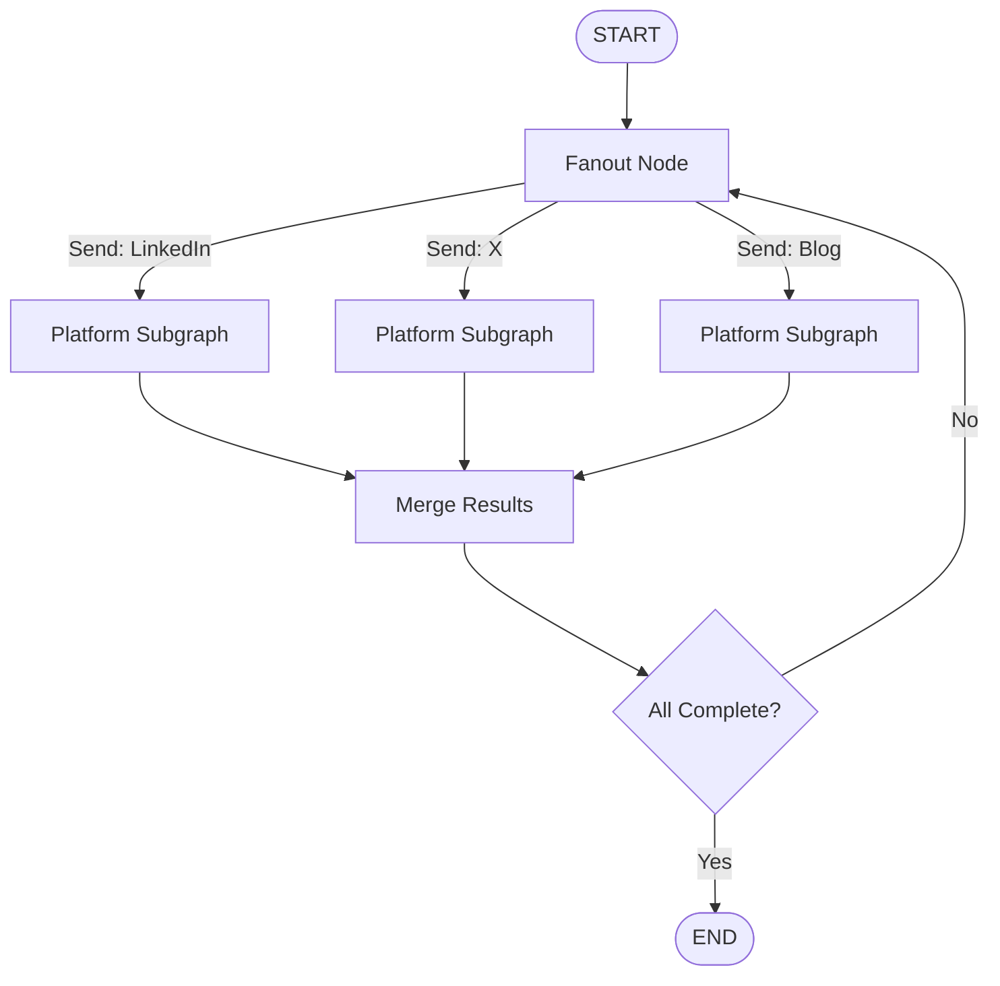
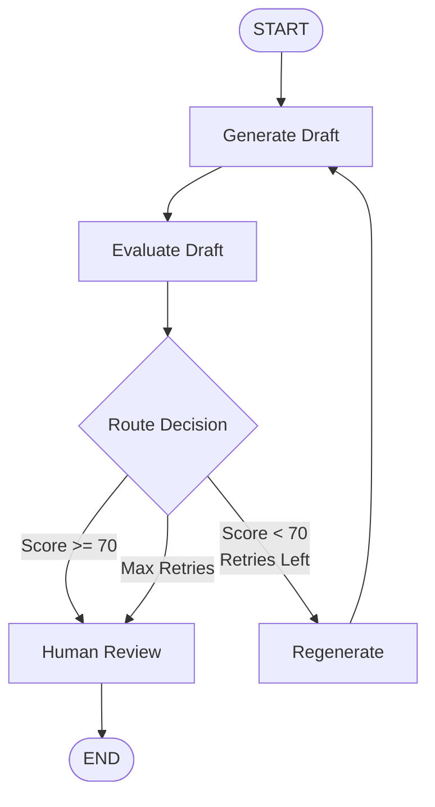

# LangGraph Architecture Guide

Deep dive into MorphPost's LangGraph-based workflow engine.

---

## Overview

MorphPost uses **LangGraph** to orchestrate AI content generation across multiple platforms with:
- ✅ Parallel platform processing
- ✅ State persistence and resumability
- ✅ Human-in-the-loop (HITL) review points
- ✅ Automatic retry with feedback
- ✅ Conditional routing based on evaluation scores

---

## Architecture Pattern: Fan-Out/Fan-In

### Main Workflow Graph

The main graph uses a **fan-out/fan-in** pattern to process platforms in parallel:



**Key Components:**

1. **Fanout Node** - Dispatches each platform to independent subgraph
2. **Platform Subgraph** - Runs once per platform (parallel execution)
3. **Merge Node** - Collects results from all platforms
4. **Check Node** - Determines if workflow is complete

---

## State Management

### WorkflowGraphState

Top-level state for the main graph:

```python
class WorkflowGraphState(TypedDict):
    workflow_id: UUID
    user_id: UUID
    mode: Literal["manual", "template"]
    
    # Input content
    source_content: Optional[str]
    template_input: Optional[dict]
    manual_options: Optional[dict]
    
    # Resources
    resources: list[ResourceInput]
    
    # Platform states (one per platform)
    platforms: list[PlatformState]
    
    # Configuration
    max_iterations: int
```

### PlatformGraphState

State for each platform subgraph:

```python
class PlatformGraphState(TypedDict):
    workflow_id: UUID
    user_id: UUID
    platform: Literal["linkedin", "x", "blog"]
    mode: Literal["manual", "template"]
    
    # Input
    source_content: Optional[str]
    template_input: Optional[dict]
    manual_options: Optional[dict]
    resources: list[ResourceInput]
    
    # Platform-specific state
    current_draft: Optional[DraftSnapshot]
    previous_drafts: list[DraftSnapshot]
    last_evaluation: Optional[EvaluationSnapshot]
    iteration: int
    
    # Status flags
    awaiting_human: bool
    accepted: bool
    rejected: bool
    
    # Configuration
    max_iterations: int
```

---

## Platform Subgraph

Each platform runs this workflow independently:



### Nodes

#### 1. Generate Node

**File:** `src/langgraph/nodes/generate.py`

**Responsibilities:**
- Build generation context from source content/template
- Call OpenAI to generate platform-specific content
- Persist draft to database
- Update state with new draft

**Key Logic:**
```python
async def generate_draft(state: PlatformGraphState) -> PlatformGraphState:
    # Build context
    context = build_generation_context(
        source_content=state.get("source_content"),
        template_input=state.get("template_input"),
        resources=state["resources"],
        manual_options=state.get("manual_options"),
    )
    
    # Generate with OpenAI
    generator = DraftGenerator()
    content = await generator.generate(
        platform=state["platform"],
        context=context,
        previous_feedback=state["last_evaluation"]["feedback"] if state["last_evaluation"] else None,
    )
    
    # Create draft snapshot
    draft = {
        "draft_id": uuid4(),
        "platform": state["platform"],
        "content": content,
        "source": "ai",
        "created_at": datetime.now(timezone.utc),
    }
    
    # Persist to DB
    await persist_draft(state["workflow_id"], state["platform"], draft)
    
    # Update state
    state["current_draft"] = draft
    state["iteration"] += 1
    
    return state
```

---

#### 2. Evaluate Node

**File:** `src/langgraph/nodes/evaluate.py`

**Responsibilities:**
- Call OpenAI to evaluate draft quality
- Score draft on multiple criteria (0-100)
- Generate feedback for potential regeneration
- Persist evaluation to database

**Evaluation Criteria:**
- Platform appropriateness
- Style consistency with user samples
- Clarity and engagement
- Grammar and formatting

**Key Logic:**
```python
async def evaluate_draft(state: PlatformGraphState) -> PlatformGraphState:
    draft = state["current_draft"]
    
    # Evaluate with OpenAI
    evaluator = DraftEvaluator()
    evaluation = await evaluator.evaluate(
        platform=state["platform"],
        content=draft["content"],
        style_samples=[r for r in state["resources"] if r["type"] == "style_sample"],
    )
    
    # Persist evaluation
    await persist_evaluation(state["workflow_id"], draft["draft_id"], evaluation)
    
    # Update state
    state["last_evaluation"] = evaluation
    
    return state
```

---

#### 3. Route Node

**File:** `src/langgraph/nodes/route.py`

**Responsibilities:**
- Decide next action based on evaluation score and iteration count
- Route to: accept, regenerate, or reject

**Routing Logic:**
```python
def route_after_evaluation(state: PlatformGraphState) -> str:
    score = state["last_evaluation"]["score"]
    iteration = state["iteration"]
    max_iterations = state["max_iterations"]
    threshold = get_settings().evaluation_score_threshold  # 70
    
    # Auto-accept if score meets threshold
    if score >= threshold:
        return "accept"
    
    # Regenerate if retries left
    if iteration < max_iterations:
        return "regenerate"
    
    # Max retries reached - send to human review
    return "reject"
```

**Routing Outcomes:**
- `accept` → HITL node (awaiting human approval)
- `regenerate` → Regenerate node → Generate node (loop)
- `reject` → HITL node (awaiting human decision)

---

#### 4. Regenerate Node

**File:** `src/langgraph/nodes/regenerate.py`

**Responsibilities:**
- Archive current draft to previous_drafts
- Clear current_draft to trigger new generation
- Preserve evaluation feedback for next generation

**Key Logic:**
```python
async def regenerate_draft(state: PlatformGraphState) -> PlatformGraphState:
    # Archive current draft
    if state["current_draft"]:
        state["previous_drafts"].append(state["current_draft"])
    
    # Clear current draft (triggers regeneration)
    state["current_draft"] = None
    
    # Feedback from last_evaluation will be used in next generation
    
    return state
```

---

#### 5. HITL Node

**File:** `src/langgraph/nodes/hitl.py`

**Responsibilities:**
- Set `awaiting_human` flag
- Pause workflow execution
- Wait for user action (accept/reject via API)

**Key Logic:**
```python
async def await_human_review(state: PlatformGraphState) -> PlatformGraphState:
    state["awaiting_human"] = True
    
    # Update platform state in database
    await update_platform_status(
        workflow_id=state["workflow_id"],
        platform=state["platform"],
        status="awaiting_review",
    )
    
    return state
```

**Resuming After HITL:**
- User calls `/review/accept` → Sets `accepted=True`, workflow continues
- User calls `/review/reject` → Clears draft, adds feedback, workflow regenerates

---

## State Persistence

### LangGraph Checkpointer

MorphPost uses **AsyncPostgresSaver** to persist workflow state:

```python
from langgraph.checkpoint.postgres.aio import AsyncPostgresSaver

# Initialize on app startup
async with AsyncPostgresSaver.from_conn_string(db_url) as checkpointer:
    await checkpointer.setup()
    workflow_graph = build_workflow_graph(checkpointer)
```

**Benefits:**
- ✅ Resume workflows after server restart
- ✅ Handle HITL interruptions
- ✅ Audit trail of all state changes
- ✅ Time-travel debugging

**Thread ID:** Each workflow has a unique thread ID (`workflow_id`) for state isolation.

---

## Workflow Execution

### Starting a Workflow

**File:** `src/langgraph/runner.py`

```python
async def run_workflow(workflow_id: UUID, initial_state: WorkflowGraphState):
    from src.langgraph.graph import workflow_graph
    
    # Execute graph with checkpointing
    config = {
        "configurable": {
            "thread_id": str(workflow_id),
        }
    }
    
    async for event in workflow_graph.astream(initial_state, config):
        # Process events (state updates)
        pass
```

### Resuming After HITL

```python
async def resume_workflow(workflow_id: UUID, updates: dict):
    from src.langgraph.graph import workflow_graph
    
    config = {
        "configurable": {
            "thread_id": str(workflow_id),
        }
    }
    
    # Resume from checkpoint with updates
    async for event in workflow_graph.astream(updates, config):
        pass
```

---

## AI Integration

### Content Generation

**File:** `src/langgraph/ai/generator.py`

Uses OpenAI GPT-4 to generate platform-specific content:

```python
class DraftGenerator:
    async def generate(
        self,
        platform: str,
        context: dict,
        previous_feedback: Optional[str] = None,
    ) -> str:
        # Build prompt with platform guidelines
        prompt = self._build_prompt(platform, context, previous_feedback)
        
        # Call OpenAI
        response = await openai.ChatCompletion.acreate(
            model=settings.llm_model,
            messages=[
                {"role": "system", "content": SYSTEM_PROMPT},
                {"role": "user", "content": prompt},
            ],
            temperature=settings.llm_temperature,
            max_tokens=settings.llm_max_tokens,
        )
        
        return response.choices[0].message.content
```

### Content Evaluation

**File:** `src/langgraph/ai/evaluator.py`

Uses OpenAI GPT-4 to evaluate draft quality:

```python
class DraftEvaluator:
    async def evaluate(
        self,
        platform: str,
        content: str,
        style_samples: list,
    ) -> dict:
        # Build evaluation prompt
        prompt = self._build_evaluation_prompt(platform, content, style_samples)
        
        # Call OpenAI with structured output
        response = await openai.ChatCompletion.acreate(
            model=settings.llm_model,
            messages=[
                {"role": "system", "content": EVALUATOR_PROMPT},
                {"role": "user", "content": prompt},
            ],
            temperature=0.3,  # Lower for consistent evaluation
            response_format={"type": "json_object"},
        )
        
        return json.loads(response.choices[0].message.content)
```

---

## Configuration

### LangGraph Settings

**File:** `src/core/config.py`

```python
class Settings(BaseSettings):
    # LangGraph Controls
    langgraph_max_iterations: int = 3
    evaluation_score_threshold: int = 70
    style_drift_tolerance: float = 0.15
```

**Parameters:**
- `langgraph_max_iterations`: Max regeneration attempts per platform
- `evaluation_score_threshold`: Minimum score to auto-accept (0-100)
- `style_drift_tolerance`: Allowed deviation from user style

---

## Error Handling

### Retry Logic

LangGraph automatically retries failed nodes with exponential backoff.

### Timeout Handling

Long-running AI calls have timeouts:
- Generation: 60 seconds
- Evaluation: 30 seconds

### Fallback Strategies

- If OpenAI fails after retries → Mark platform as failed, continue others
- If database fails → Workflow pauses, can resume after fix

---

## Performance Optimization

### Parallel Execution

Platforms process completely independently:
- LinkedIn, X, and Blog generate simultaneously
- No blocking between platforms
- Merge only waits for completion

### Caching

- Style samples cached per user
- Platform guidelines cached globally

### Database Optimization

- Batch inserts for drafts and evaluations
- Indexed queries on workflow_id and platform

---

## Monitoring & Debugging

### Logging

All nodes log key events:
```python
log.info(
    "Draft generated | workflow_id={} | platform={} | iteration={}",
    workflow_id,
    platform,
    iteration,
)
```

### State Inspection

Query checkpointer for workflow state:
```python
state = await checkpointer.aget(config)
```

### Event Streaming

Monitor workflow progress in real-time:
```python
async for event in workflow_graph.astream(state, config):
    print(f"Node: {event['node']}, State: {event['state']}")
```

---

## Best Practices

1. **Keep nodes pure** - No side effects except DB persistence
2. **Use TypedDict for state** - Type safety and IDE support
3. **Log all state transitions** - Debugging and audit trail
4. **Handle missing data gracefully** - Optional fields with defaults
5. **Test nodes independently** - Unit test each node function
6. **Monitor iteration counts** - Prevent infinite loops

---

## Future Enhancements

- [ ] A/B testing different prompts
- [ ] Multi-model support (Claude, Gemini)
- [ ] Streaming generation for real-time preview
- [ ] Workflow templates for common use cases
- [ ] Advanced routing with ML-based scoring
